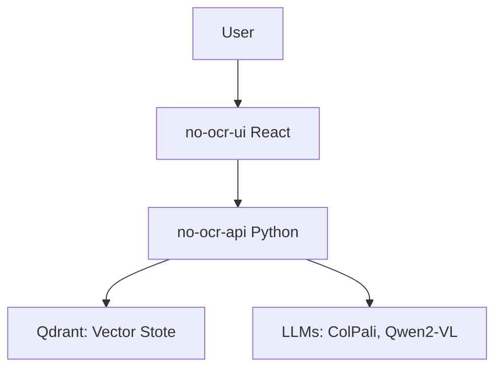
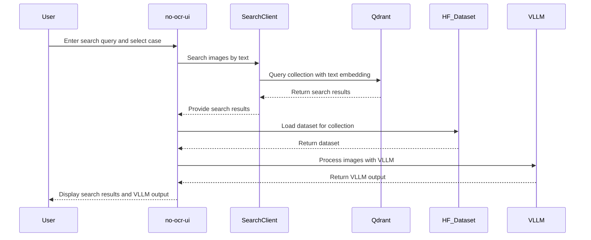

# No OCR

A simple tool for exploring documents with AI, no fancy text extraction required. Just upload your files, then quickly search or ask questions about content across multiple collections.

> **Table of Contents**
> 1. [Overview](#overview)  
> 2. [Key Features](#key-features)  
> 3. [Architecture](#architecture)  
> 4. [Installation](#installation)  
> 5. [Usage](#usage)  
> 6. [Roadmap](#roadmap)  
> 7. [Contributing](#contributing)  
> 8. [Support](#support)  
> 9. [License](#license)

## Overview

The core purpose of "No OCR" is to simplify AI-based PDF or image processing:
- Process and store PDF pages or images without relying on OCR.  
- Perform text and/or visual queries using modern embeddings.  
- Use open source models for advanced question-answering on document-based diagrams, text, and more.

Key technologies:
- React-based front end (no-ocr-ui) for uploading, managing, and searching documents.  
- Python-based API (no-ocr-api) that coordinates ingestion, indexing, and searching.  
- Qdrant for efficient vector search and retrieval.  
- ColPali & Qwen2-VL handle inference tasks (both text and vision-based).  

## Key Features

- Create and manage PDF/document collections, also referred to as "cases".  
- Automated ingestion to build Hugging Face-style datasets (HF_Dataset).  
- Vector-based search over PDF pages (and relevant images) in Qdrant.  
- Visual question-answering on images and diagrams via Qwen2-VL.  
- Deployable via Docker for both the backend (Python) and UI (React).

## Architecture

Below is a high-level workflow overview:



## Flow

Create caseL


Use AI Search



## Description
This repository includes two main components:
- no-ocr-api: A Python API for ingesting and searching PDF collections
- no-ocr-ui: A React application for creating, managing, and visualizing PDF collections

## Prerequisites
- Python 3.x
- Node.js 18.x
- Docker (optional for containerized deployments)

## Installation
1. Clone the repository:
   ```bash
   git clone <repository-url>
   ```

2. (API) Install dependencies:
   ```bash
   cd no-ocr-api
   pip install -r requirements.txt
   ```

3. (UI) Install dependencies:
   ```bash
   cd ../no-ocr-ui
   npm install
   ```

4. (Optional) Build Docker images:
   - For the API:
     ```bash
     docker build -t no-ocr-api .
     ```
   - For the UI:
     ```bash
     docker build -t no-ocr-ui .
     ```

## Usage

### Local Development
1. Run the API:
   ```bash
   cd no-ocr-api/
   fastapi dev api.py
   ```
   The API is now accessible at http://localhost:8000

2. Run the UI:
   ```bash
   npm run dev
   ```
   The UI is now accessible at http://localhost:3000

### Docker
1. Run the API container:
   ```bash
   docker run -p 8000:8000 no-ocr-api
   ```
2. Run the UI container:
   ```bash
   docker run -p 8080:80 no-ocr-ui
   ```
3. Access the API at http://localhost:8000 and the UI at http://localhost:8080

## Features
- AI-powered PDF search for quick document retrieval
- Simple PDF collection management
- Optional user authentication with Supabase
