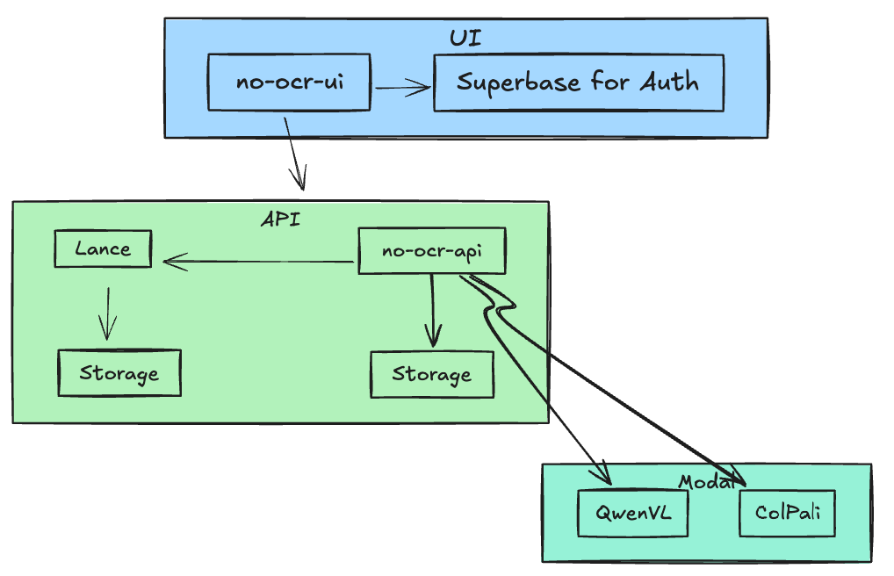
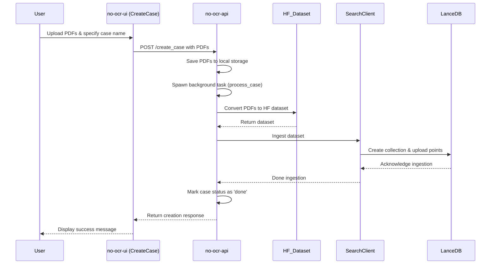
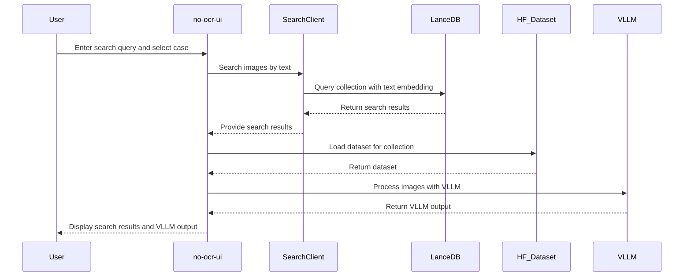

# No OCR

A simple tool for exploring documents with AI, no fancy text extraction required. Just upload your files, then quickly search or ask questions about content across multiple collections.

## Release blog with details 

Here is a blog with release details about this project: [No-OCR Product](https://kyrylai.com/2025/01/10/no-ocr-product/)

Additional background can be found on [DeepWiki](https://deepwiki.com/kyryl-opens-ml/no-ocr).

## Demo

Here's a quick GIF demonstrating the basic flow of using No OCR:


> **Table of Contents**
> 1. [Overview](#overview)  
> 2. [Key Features](#key-features)  
> 3. [Architecture](#architecture)  
> 4. [Flow](#flow)  
> 5. [Roadmap](#roadmap)  
> 6. [Prerequisites](#prerequisites)  
> 7. [Dev Installation](#dev-installation)  

## Overview

The core purpose of "No OCR" is to simplify AI-based PDF processing:
- Process and store PDF pages without relying on OCR.  
- Perform text and/or visual queries using modern embeddings.  
- Use open source models for advanced question-answering on document-based diagrams, text, and more.

## Key Features

- Create and manage PDF/document collections, also referred to as "cases".  
- Automated ingestion to build Hugging Face-style datasets (HF_Dataset).  
- Vector-based search over PDF pages (and relevant images) in LanceDB.  
- Visual question-answering on images and diagrams via Qwen2-VL.  
- Deployable via Docker for both the backend (Python) and UI (React).

## Architecture

Below is a high-level workflow overview:



## Flow

Create case:



Search:



## Roadmap 

- Better models for reasoning and retrieval 72B and QVQ.
- Agentic workflows - go beyond search and toward complete peace of work.
- Training models per case - turn your workflow into data moat and train unique models.
- UI/UX improvement - simplify, simplify, simplify.


## Prerequisites
- Python 3.x
- Node.js 18.x
- Docker (optional for containerized deployments)
- Supabase 
  - Create an account at https://app.supabase.io/
  - Create a `.env` file in the `no-ocr-ui` directory
  - Add the following variables to the `.env` file:
    ```
    VITE_SUPABASE_URL=""
    VITE_SUPABASE_ANON_KEY=""
    VITE_REACT_APP_API_URI=""
    ```
- Modal 
  - Create an account at https://modal.com/
  - Deploy models:
    ```bash
    pip install modal
    modal setup

    modal run no-ocr-llms/llm_serving_load_models.py --model-name Qwen/Qwen2-VL-7B-Instruct --model-revision 51c47430f97dd7c74aa1fa6825e68a813478097f
    modal run no-ocr-llms/llm_serving_load_models.py --model-name vidore/colqwen2-v1.0-merged --model-revision 364a4f5df97231e233e15cbbaf0b9dbe352ba92c


    modal deploy no-ocr-llms/llm_serving.py
    modal deploy no-ocr-llms/llm_serving_colpali.py
    ```
  - Create a `.env` file in the `no-ocr-api` directory
  - Update the environment variables.

## Dev Installation

1. Clone the repository:
   ```bash
   git clone https://github.com/kyryl-opens-ml/no-ocr
   ```

2. (API) Install dependencies:
   ```bash
   cd no-ocr-api
   pip install -r requirements.txt
   ```

2. (API) Run server:
   ```bash
   cd no-ocr-api
   fastapi dev api.py
   ```

4. (UI) Install dependencies:
   ```bash
   cd no-ocr-ui
   npm install
   ```
4. (UI) Run UI:
   ```bash
   cd no-ocr-ui
   npm run dev
   ```
