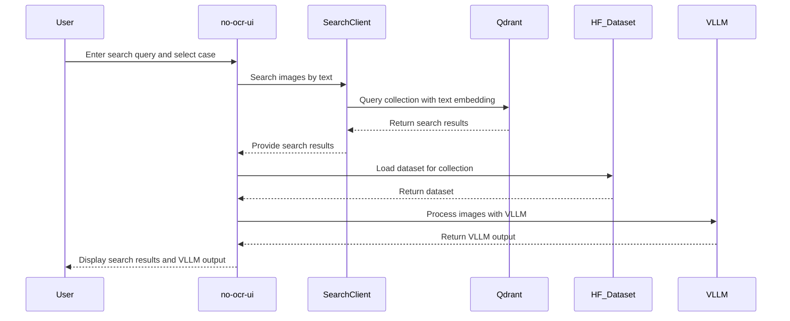

# No OCR

A simple tool for exploring documents with AI, no fancy text extraction required. Just upload your files, then quickly search or ask questions about content across multiple collections.

## Release blog with details 

Here is a blog with release details about this project: [URL]()

## Flow

Here's a quick GIF demonstrating the basic flow of using No OCR:


> **Table of Contents**
> 1. [Overview](#overview)  
> 2. [Key Features](#key-features)  
> 3. [Architecture](#architecture)  
> 4. [Installation](#installation)  
> 5. [Usage](#usage)  
> 6. [Roadmap](#roadmap)  
> 7. [Contributing](#contributing)  
> 8. [Support](#support)  
> 9. [License](#license)

## Overview

The core purpose of "No OCR" is to simplify AI-based PDF processing:
- Process and store PDF pages without relying on OCR.  
- Perform text and/or visual queries using modern embeddings.  
- Use open source models for advanced question-answering on document-based diagrams, text, and more.

Key technologies:
- React-based front end (no-ocr-ui) for uploading, managing, and searching documents.  
- Python-based API (no-ocr-api) that coordinates ingestion, indexing, and searching.  
- Qdrant for efficient vector search and retrieval.  
- ColPali & Qwen2-VL handle inference tasks (both text and vision-based).  

## Key Features

- Create and manage PDF/document collections, also referred to as "cases".  
- Automated ingestion to build Hugging Face-style datasets (HF_Dataset).  
- Vector-based search over PDF pages (and relevant images) in Qdrant.  
- Visual question-answering on images and diagrams via Qwen2-VL.  
- Deployable via Docker for both the backend (Python) and UI (React).

## Architecture

Below is a high-level workflow overview:


## Flow

Create caseL


Use AI Search



## Roadmap 

- Better models for reasoning and retrieval 72B and QVQ.
- Agentic workflows - go beyond search and toward complete peace of work.
- Training models per case - turn your workflow into data moat and train unique models.
- UI/UX improvement - simplify, simplify, simplify.


## Prerequisites
- Python 3.x
- Node.js 18.x
- Docker (optional for containerized deployments)
- Superbase 
- Modal 

## Dev Installation

1. Clone the repository:
   ```bash
   git clone https://github.com/kyryl-opens-ml/no-ocr
   ```

2. (API) Install dependencies:
   ```bash
   cd no-ocr-api
   pip install -r requirements.txt
   ```

2. (API) Run server:
   ```bash
   cd no-ocr-api
   fastapi dev api.py
   ```

4. (UI) Install dependencies:
   ```bash
   cd no-ocr-ui
   npm install
   ```
4. (UI) Run UI:
   ```bash
   cd no-ocr-ui
   npm run dev
   ```
5. (Qdrant) Run qdrant
   ```bash
  docker run -p 6333:6333 qdrant/qdrant:v1.12.5
   ```