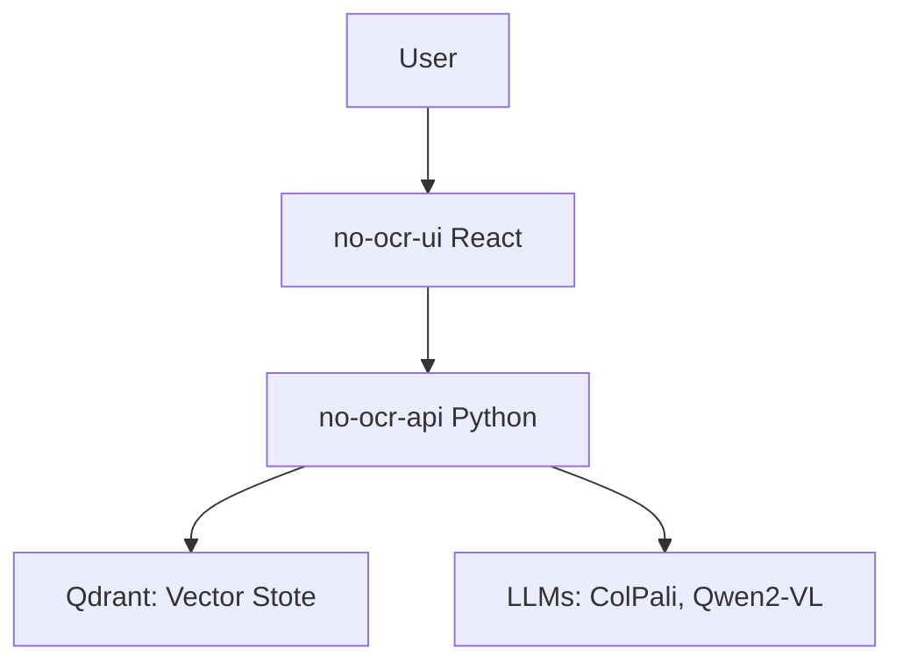
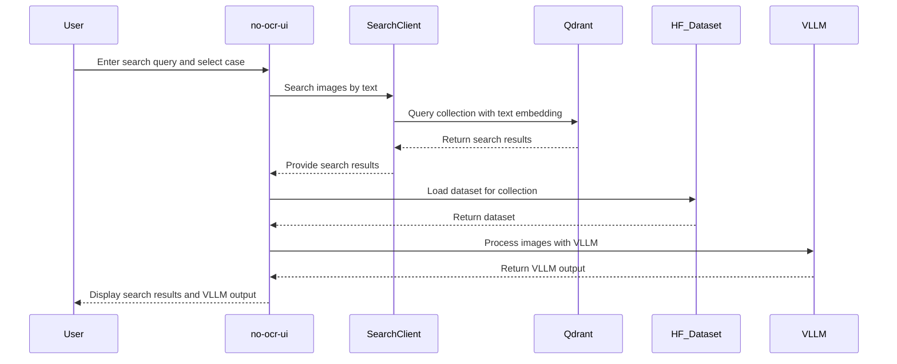

# No OCR

## Overview 


A streamlined React + Python solution for document-first AI. It uses embeddings (ColPali, Qwen2-VL) with Qdrant for vector search, and highlights multi-case document handling and visual question support via open source models.

## Architecture 

1. The user interacts with our snazzy No OCR UI, built in React.  
2. Their requests flow into the No OCR API, a Python backend that orchestrates everything.  
3. Qdrant provides vector search storage to quickly find the right PDF segments (with all the heavy-lifting behind the scenes).  
4. Meanwhile, ColPali and Qwen2-VL handle advanced inference, doing the “thinking” so you don’t have to.  
5. Storage volumes keep data tidy and safe, ensuring easy Docker-based deployments.  

And that’s how we turn PDFs (quirky diagrams, messy text, and all) into delightful, AI-driven insights!

## Components 



## Flow

Create caseL


Use AI Search



## Description

The No OCR API is a Python-based application designed to handle image processing tasks without relying on Optical Character Recognition (OCR). It provides a streamlined API for efficient image evaluation and manipulation.

## Installation

1. Clone the repository:
   ```bash
   git clone <repository-url>
   cd no-ocr-api
   ```

2. Build the Docker image:
   ```bash
   docker build -t no-ocr-api .
   ```

3. Install dependencies:
   ```bash
   pip install -r requirements.txt
   ```

## Usage

1. Run the API:
   ```bash
   python api.py
   ```

2. Alternatively, run the API using Docker:
   ```bash
   docker run -p 8000:8000 no-ocr-api
   ```

3. Access the API at `http://localhost:8000`.


# no-ocr-ui

A React-based web application for managing and searching PDF collections using AI.

## Features

- Create and manage PDF collections
- AI-powered search for efficient document retrieval
- User authentication with Supabase

## Getting Started

### Prerequisites

- Node.js 18.x
- Docker (for production deployment)

### Development

1. Clone the repository:
   ```bash
   git clone https://github.com/yourusername/no-ocr-ui.git
   cd no-ocr-ui
   ```

2. Install dependencies:
   ```bash
   npm install
   ```

3. Start the development server:
   ```bash
   npm run dev
   ```

### Production Deployment with Docker

1. Build the Docker image:
   ```bash
   docker build -t no-ocr-ui .
   ```

2. Run the Docker container:
   ```bash
   docker run -p 8080:80 no-ocr-ui
   ```

3. Access the application:
   - Open your browser and navigate to [http://localhost:8080](http://localhost:8080)

